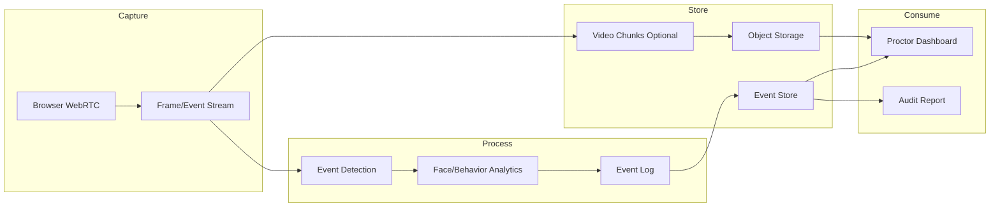
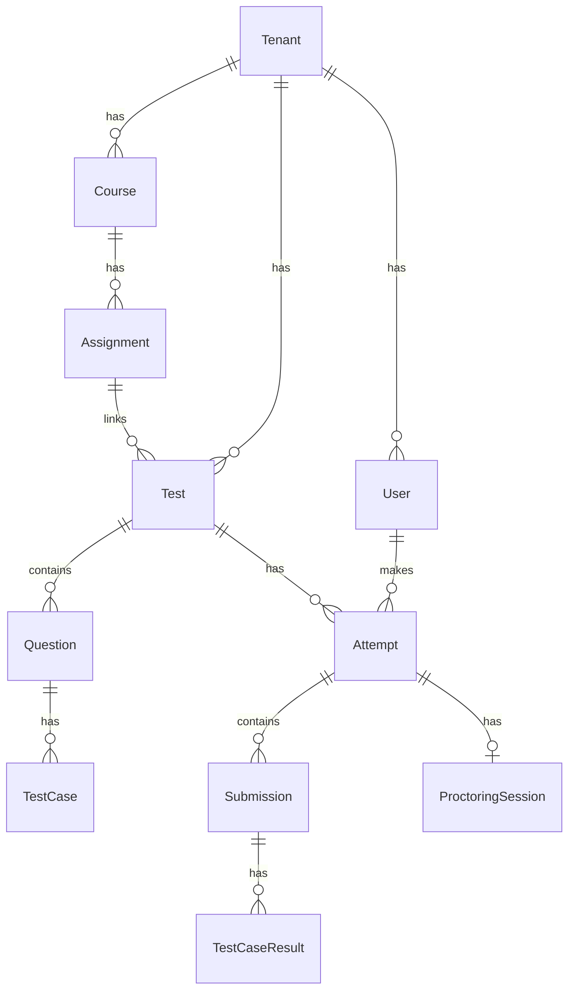

# Technical Design Document (TDD)
# White-label SaaS Mock Test & Coding Assessment Platform

## Document Control

| Field | Value |
|-------|-------|
| Document Name | Technical Design Document |
| Version | v1.0 |
| Date | 15 Feb 2026 |
| Owner | Platform Engineering |
| Related | [BRD v2.1](BRD-v2.1.md) |

---

## 1. Overview

This document provides the technical architecture for the White-label SaaS Mock Test & Coding Assessment Platform. It complements the [Business Requirements Document (BRD)](BRD-v2.1.md) and covers tenant isolation, code execution, proctoring pipeline, and API design.

---

## 2. Tenant Isolation Strategy

### 2.1 Approach

**Recommended: Shared database with `tenant_id` (row-level isolation)**

| Approach | Pros | Cons |
|----------|------|------|
| **Shared DB + tenant_id** | Cost-effective, simpler ops, easy cross-tenant analytics for platform | Requires strict query filters; risk of data leakage if code error |
| Schema-per-tenant | Strong isolation, easier per-tenant backup | Higher connection overhead; schema migration complexity |
| Database-per-tenant | Maximum isolation, tenant-specific scaling | High operational cost; difficult to manage at scale |

**Rationale:** For MVP and typical scale (10–500 tenants), shared DB with tenant_id and application-level enforcement is sufficient. Migrate to schema-per-tenant if compliance or scale demands.

### 2.2 Implementation

- Every tenant-scoped table has `tenant_id` (UUID, indexed, NOT NULL).
- All queries MUST filter by `tenant_id`; use framework middleware or repository pattern to enforce.
- Platform-operator tables (tenants, plans, global config) are tenant-agnostic.
- Encryption: tenant-specific encryption keys for sensitive fields (e.g., proctoring recordings) where feasible; keys stored in secrets manager.

---

## 3. Code Execution (Judge) Architecture

### 3.1 Requirements

- Isolated execution: no outbound network, filesystem restrictions.
- Resource limits: CPU (e.g., 2 cores), memory (e.g., 512MB–1GB), time (e.g., 5–30s per run).
- Supported languages: Python 3.x, Java 11+, C++17, JavaScript (Node.js 18+).

### 3.2 Options

| Option | Pros | Cons |
|--------|------|------|
| **Docker** | Widely used, good isolation, language flexibility | Slightly heavier; requires orchestration |
| gVisor | Stronger kernel isolation | More complex setup |
| Firecracker | Lightweight, fast cold start | Lower ecosystem maturity |
| Managed (e.g., AWS Lambda, judge0) | Less infra to manage | Vendor lock-in; customization limits |

### 3.3 Recommended: Docker-based Judge

- Each submission runs in a fresh container; image per language/runtime.
- Orchestrator (e.g., Celery, Bull, or custom worker pool) pulls from queue, spins container, streams output, tears down.
- Queue: Redis or SQS for submission jobs; priority queue for scheduled tests.
- Scaling: horizontal workers; autoscale based on queue depth and latency.

### 3.4 Sandbox Constraints

- No network egress; read-only filesystem except `/tmp`.
- User runs as non-root; ulimit for CPU/memory/time.
- Output size limit (e.g., 1MB) to prevent log bombing.

---

## 4. Proctoring Pipeline

### 4.1 Flow

### 4.2 Components

- **Capture**: Student browser sends WebRTC stream (video + optional audio) and metadata (tab focus, fullscreen) to backend. Frame rate/configurable (e.g., 1 fps for monitoring, higher for recording).
- **Event detection**: Server-side or edge processing for face detection, multiple faces, looking away. Configurable thresholds.
- **Storage**: Event log (DB or append-only store); video chunks in object storage (S3/GCS) if retention enabled. Signed URLs for playback.
- **Integration**: Design allows for third-party proctoring (e.g., Proctorio, Examity) via adapter pattern—same event schema, different capture source.

---

## 5. API Design

### 5.1 Style

- **REST** for primary APIs (simplicity, caching, tooling).
- **WebSockets** for real-time: proctor dashboard, live test status, code execution stream.

### 5.2 Versioning

- URL path: `/api/v1/...`
- Breaking changes require new version; maintain at least one prior version for 6 months.

### 5.3 Authentication

- **JWT**: Access token (short-lived, e.g., 15 min) + refresh token. Stored in httpOnly cookie or mobile secure storage.
- **OAuth2**: For SSO (optional); support OIDC providers (Google, Microsoft, custom).
- **API Keys**: For server-to-server (webhooks, exports); scoped per tenant; rotate periodically.

### 5.4 Tenant Context

- `X-Tenant-Id` header or JWT claim for tenant-scoped requests.
- Platform operator APIs use separate scope (e.g., `/admin/platform/`).

---

## 6. Data Model (Core Entities)

### 6.1 Entity Summary

| Entity | Key Fields |
|--------|------------|
| Tenant | id, name, slug, plan_id, branding_config, domain, status |
| User | id, tenant_id, email, role, cohort_ids |
| Test | id, tenant_id, title, type (coding/mcq), config, schedule |
| Question | id, tenant_id, type, content, difficulty, tags |
| TestCase | id, question_id, input, expected_output, is_public, weight |
| Attempt | id, user_id, test_id, started_at, submitted_at, score, status |
| Submission | id, attempt_id, question_id, code/language, status |
| ProctoringSession | id, attempt_id, events[], recording_url, retention_until |

---

## 7. Integration Contracts

### 7.1 Stripe Webhooks

- Events: `customer.subscription.created/updated/deleted`, `invoice.paid`, `payment_intent.succeeded`
- Idempotency: Store `event_id`; ignore duplicates.
- Action: Update tenant entitlement, plan, and status.

### 7.2 Razorpay Webhooks

- Events: `subscription.activated`, `subscription.cancelled`, `payment.captured`
- Idempotency: Same pattern as Stripe.
- Action: Sync subscription and payment status to platform.

---

## 8. Deployment and Scaling

- **App servers**: Stateless; scale horizontally behind load balancer.
- **Judge workers**: Separate pool; scale based on queue depth.
- **Database**: Primary + read replicas for reporting queries.
- **Cache**: Redis for sessions, rate limiting, queue.
- **Storage**: Object storage for uploads, submissions, proctoring media.

---

## 9. Security Considerations

- Secrets in vault (e.g., HashiCorp Vault, AWS Secrets Manager).
- All tenant data encrypted at rest; TLS in transit.
- WAF in front of public APIs.
- Regular dependency scanning and SAST in CI/CD.
