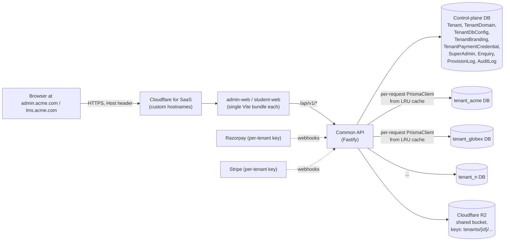
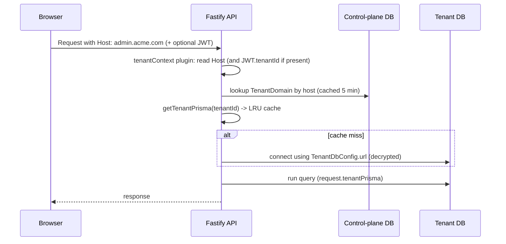

# Tenant Whitelisting / White-Label Plan

Status: Draft v1.0 — approved for execution
Owner: Rankership platform team
Date: 2026-04-28

This document is the single source of truth for converting the current single-database multi-tenant LMS into a true white-label SaaS platform. It covers data isolation, hosting, branding, payments, provisioning, security, and a phased rollout.

---

## 1. Goals

1. **Strict data isolation** — a tenant's data must not be reachable from any other tenant, even if application code has bugs. Isolation must be enforced by the database, not just by application middleware.
2. **Per-tenant UI** — every tenant gets their own admin URL and student URL, with their own logo, colors, favicon, product name and (optionally) custom CSS.
3. **Per-tenant payment gateway** — every tenant connects their own Razorpay and/or Stripe account; Rankership never holds their funds.
4. **One shared API server** — a single Fastify deployment serves all tenants; no per-tenant code forks.
5. **Self-serve whitelisting** — Rankership super admins can whitelist a new tenant from a UI in minutes (provision DB, set branding, attach domain, attach payment keys).
6. **Rankership super-admin oversight** — Rankership staff can read/manage any tenant's data on demand for support.

## 2. Non-goals (this phase)

- Recurring subscription billing (one-time course/batch purchases only).
- Multi-region / cross-region replication.
- Per-tenant judge service (the code-running sandbox stays shared; it handles only code + test cases, no PII).
- Per-tenant Sentry projects (single Sentry project with `tenant` tag is sufficient).

## 3. Current state (baseline)

- Single Postgres DB, single `PrismaClient` — see [apps/api/src/lib/prisma.ts](../apps/api/src/lib/prisma.ts).
- Multi-tenancy via `tenantId` columns on every model — see [apps/api/prisma/schema.prisma](../apps/api/prisma/schema.prisma).
- Tenant resolution via `X-Tenant-Id` header or JWT `tenantId` claim — see [apps/api/src/lib/tenant.ts](../apps/api/src/lib/tenant.ts).
- API CORS already loads tenant `domain` dynamically — see [apps/api/src/lib/domainCheck.ts](../apps/api/src/lib/domainCheck.ts).
- Three Vite SPAs (`admin-web`, `student-web`, `landing-web`) on Cloudflare Pages, each a single shared bundle for all tenants.
- Storage: one Cloudflare R2 bucket.
- Hosting today: `api.rankership.com`, `admin.rankership.com`, `student.rankership.com`, `rankership.com` — see [Caddyfile](../Caddyfile), [docker-compose.prod.yml](../docker-compose.prod.yml).
- No payment gateway integration exists yet.

## 4. Architecture chosen: Hybrid

> **Decision**: control-plane DB + database-per-tenant on the same Postgres cluster, with a dedicated DB role per tenant.
> **Rejected alternatives** and why:
> - *Schema-per-tenant in one DB* — only one DB role, isolation is enforced solely by app code; a single bug leaks data across tenants.
> - *Separate Postgres instance per tenant* — same isolation as our chosen model but multiplies hosting cost and ops by N.

Every API request talks to two databases:

- **Control-plane DB** — small, always available. Holds tenant registry, super-admin users, branding, encrypted payment creds, billing/audit, and the cross-tenant landing-page enquiries. One `PrismaClient`.
- **Tenant DB** — everything tenant-scoped today (users, tests, questions, courses, batches, attempts, …). Resolved per request, cached in an LRU.

## 5. Tenant resolution flow

Resolution order in the `tenantContext` Fastify plugin:

1. `X-Tenant-Id` header — accepted only for authenticated super-admin requests.
2. `Host` header — looked up in `TenantDomain` (control plane), cached 5 minutes.
3. JWT `tenantId` claim — fallback for API-only callers (future).

Super-admin requests use the control-plane prisma directly and may pass `?tenantId=...` to fan into a specific tenant DB for support. Every such cross-tenant access is written to `AuditLog` in the control plane.

## 6. Schema split

### 6.1 Control-plane DB — new Prisma project at `apps/api/prisma-control/schema.prisma`

| Model | Purpose |
|---|---|
| `Tenant` | id, slug, name, status, plan, createdAt. Moved from current schema. |
| `TenantDomain` | tenantId, host, kind (`admin` \| `student`), verifiedAt, cloudflareHostnameId. Replaces today's single `Tenant.domain`. |
| `TenantDbConfig` | tenantId, connectionUrl (AES-256-GCM encrypted with `TENANT_SECRETS_KEY`), dbName, dbRole, provisionedAt, migrationVersion. |
| `TenantBranding` | tenantId, logoUrl, faviconUrl, primaryColor, accentColor, productName, supportEmail, customCss?, featureFlags. |
| `TenantPaymentCredential` | tenantId, provider (`razorpay` \| `stripe`), mode (`live` \| `test`), publicKey, secretKeyEncrypted, webhookSecretEncrypted, currency, isActive. One row per provider per tenant. |
| `SuperAdmin` | Rankership staff (separate from tenant `User`). Email, passwordHash, mfaSecret, isActive. |
| `Enquiry` | Moved from current schema (landing page, cross-tenant). |
| `ProvisionLog` | Append-only log for whitelisting actions (DB created, migration run, hostname verified, etc.). |
| `AuditLog` | Append-only log for super-admin cross-tenant accesses and impersonation. |

Generator config: emits client to `node_modules/@prisma-control/client` (separate from the tenant client) so both clients can coexist in the API process.

### 6.2 Tenant DB — `apps/api/prisma/schema.prisma` (existing, trimmed)

- Keep every model **except** `Tenant`, `Enquiry`. Drop the `tenantId` column from every model — the database boundary now is the tenant, so the column is redundant and risks confusion.
- Drop relations like `tenant Tenant @relation(...)`.
- New: `Order`, `Payment`, `PaymentEvent` for course/batch purchases (see §9).

## 7. Code changes (most important files)

### 7.1 New files

- [apps/api/prisma-control/schema.prisma](../apps/api/prisma-control/schema.prisma) — control-plane Prisma schema.
- [apps/api/src/lib/controlPrisma.ts](../apps/api/src/lib/controlPrisma.ts) — singleton control-plane client.
- [apps/api/src/lib/tenantPrisma.ts](../apps/api/src/lib/tenantPrisma.ts) — `getTenantPrisma(tenantId)`, LRU `Map<tenantId, PrismaClient>` (max 50, idle-evict 30 min, on eviction `await client.$disconnect()`).
- [apps/api/src/lib/crypto.ts](../apps/api/src/lib/crypto.ts) — AES-256-GCM helpers for DB URLs and payment secrets. Master key from `TENANT_SECRETS_KEY` env (32 random bytes, base64).
- [apps/api/src/plugins/tenantContext.ts](../apps/api/src/plugins/tenantContext.ts) — Fastify plugin that decorates `request.tenant` and `request.tenantPrisma`.
- [apps/api/src/lib/provision.ts](../apps/api/src/lib/provision.ts) — `provisionTenant(...)` orchestrator (see §10).
- [apps/api/src/routes/branding.ts](../apps/api/src/routes/branding.ts) — `GET /api/v1/branding` resolves by `Host`, returns `TenantBranding`. **Public, no auth.**
- [apps/api/src/routes/admin/tenants.ts](../apps/api/src/routes/admin/tenants.ts) — super-admin CRUD: create tenant (provisions DB), update branding, manage domains, set payment creds, activate/suspend.
- [apps/api/src/routes/payments.ts](../apps/api/src/routes/payments.ts) — `POST /orders`, `POST /orders/:id/verify`, `POST /webhooks/razorpay/:tenantId`, `POST /webhooks/stripe/:tenantId`.
- [apps/api/scripts/migrate-to-tenant-dbs.ts](../apps/api/scripts/migrate-to-tenant-dbs.ts) — one-shot migration from the legacy single DB to per-tenant DBs.
- `apps/superadmin-web/` — new Vite SPA (see §11).

### 7.2 Refactored files

- [apps/api/src/lib/prisma.ts](../apps/api/src/lib/prisma.ts) — keep as a re-export of `controlPrisma` for super-admin/control-plane routes only. **All tenant routes switch to `request.tenantPrisma`.**
- Every file in [apps/api/src/routes/](../apps/api/src/routes/) — replace `prisma` import with `request.tenantPrisma`, drop `tenantId` from `where` clauses (no longer needed). `requireTenant` still asserts authorization context but queries no longer filter by `tenantId`. Refactor file-by-file across M3.
- [apps/api/src/lib/domainCheck.ts](../apps/api/src/lib/domainCheck.ts) — pull allowed origins from `TenantDomain` table in control plane.
- [apps/api/src/lib/storage.ts](../apps/api/src/lib/storage.ts) — enforce `tenants/<tenantId>/` key prefix and reject keys missing the active tenant's prefix.

## 8. UI strategy: custom domains + runtime branding

Decision: **Cloudflare for SaaS Custom Hostnames** (chosen by user from option C).

- DNS: Tenant points a CNAME at `admin.rankership.com` (admin) and `lms.rankership.com` (student). Cloudflare for SaaS automatically issues TLS for `admin.acme.com`, `learn.acme.com`, etc.
- The super-admin "Whitelist Tenant" wizard automates Cloudflare hostname registration via the Cloudflare API, then polls for verification status.
- One Vite bundle per app. The bundle reads its host at runtime, calls `GET /api/v1/branding` before rendering, then:
  - Injects branding values as CSS vars on `:root` (already used by [apps/admin-web/src/index.css](../apps/admin-web/src/index.css)).
  - Sets `<title>` and `<link rel="icon">`.
  - Exposes a `BrandingContext` so components read product name, colors, support email.
- `VITE_API_URL` keeps a single value: `https://api.rankership.com`. The frontend never needs to know which tenant it is — the API resolves the tenant from the `Host` of the admin/student site, and from the JWT after login.

## 9. Payments (per-tenant accounts)

Decision: **Razorpay + Stripe** (chosen by user from option C). Tenants pick whichever fits their region.

- Tenants enter their own credentials in the admin UI: Razorpay `key_id` + `key_secret` + `webhook_secret`, and/or Stripe `publishable_key` + `secret_key` + `webhook_secret`. Stored AES-256-GCM encrypted in `TenantPaymentCredential`.
- New tenant-DB models:
  - `Order(id, userId, courseId|batchId, amount, currency, status, provider, providerOrderId, createdAt)`
  - `Payment(id, orderId, providerPaymentId, status, rawPayload)`
  - `PaymentEvent(id, provider, eventType, signatureValid, rawPayload, receivedAt)`
- Webhook URLs are tenant-scoped: `/api/v1/payments/webhooks/razorpay/:tenantId` and `/api/v1/payments/webhooks/stripe/:tenantId`. The handler loads that tenant's webhook secret and verifies the signature; on success it loads `request.tenantPrisma` and writes the order/payment.
- Frontend integration scope for this phase: minimal **course/batch checkout** flow on student-web. Stripe Checkout (hosted) and Razorpay Standard Checkout (modal). One-time only; subscriptions deferred.
- "Test connection" button in admin UI: places a tiny test-mode order against the configured provider to validate credentials.

## 10. Provisioning a new tenant

`provisionTenant({ slug, name, adminEmail, adminName, plan?, region? })`:

1. Validate slug uniqueness in control plane.
2. Connect with `TENANT_DB_ADMIN_URL` (Postgres superuser used **only** for provisioning, never at request time):
   - `CREATE ROLE tenant_<slug>_role LOGIN PASSWORD '<random>';`
   - `CREATE DATABASE tenant_<slug> OWNER tenant_<slug>_role;`
   - `REVOKE ALL ON DATABASE tenant_<slug> FROM PUBLIC;`
3. Run `prisma migrate deploy` against the new DB using the new role's URL.
4. Insert `TenantDbConfig` row with the connection URL encrypted via `TENANT_SECRETS_KEY`.
5. Seed first `User` (role `admin`) in the new tenant DB with a temporary password; email a magic-link to `adminEmail`.
6. Insert default `TenantBranding` (Rankership defaults).
7. Optionally call Cloudflare for SaaS API to add custom hostname(s) provided in the wizard.
8. Write `ProvisionLog` entry in control plane (one row per step, success/failure timestamps).

Provisioning is idempotent and resumable: each step checks for prior completion in `ProvisionLog`.

## 11. Super-admin "Whitelist a Tenant" UI

New app `apps/superadmin-web/`, hosted at `super.rankership.com`. Auth against `SuperAdmin` table with mandatory MFA. Pages:

- **Tenants list** — status, plan, primary domain, quick actions (suspend, login-as).
- **New Tenant wizard** — name, slug, admin email, admin name, optional custom hostnames → triggers `provisionTenant`. Shows live progress (DB created → migrated → seeded → domain pending verification).
- **Branding editor** — upload logo/favicon to R2 under `tenants/{id}/branding/`, pick colors, edit product name, custom CSS textarea, live preview.
- **Domains panel** — add admin/student hostnames; show Cloudflare verification status + DNS instructions to give the tenant.
- **Payments panel** — paste Razorpay/Stripe keys, "test connection" button.
- **Login as tenant admin** — generates short-lived JWT for support sessions, writes to `AuditLog`.
- **Suspend / resume / delete** — set tenant status; delete keeps the DB but blocks routing.

## 12. Storage isolation

- Keep one R2 bucket; enforce **`tenants/<tenantId>/`** key prefix in [apps/api/src/lib/storage.ts](../apps/api/src/lib/storage.ts). Add a guard in storage helpers that rejects keys missing the prefix for the active tenant — prevents an accidental cross-tenant fetch even if a route bug constructs the wrong key.
- Branding assets at `tenants/<tenantId>/branding/{logo,favicon}`.
- Existing files in production must be rewritten to the new prefix during M7 cutover (script provided as part of `migrate-to-tenant-dbs.ts`).

## 13. Security details

- `TENANT_SECRETS_KEY` (32-byte AES key, base64) and `TENANT_DB_ADMIN_URL` (Postgres superuser used only by provisioning) added to API env. Document handling in [apps/api/.env.example](../apps/api/.env.example).
- Each per-tenant DB has its own role with privileges only on its own DB.
- The application connection pool runs as the per-tenant role, never as the superuser. Postgres rejects cross-DB queries from these roles.
- Per-tenant rate limiting in the API (`@fastify/rate-limit` keyed by `request.tenant.id`).
- Webhook signatures are verified before any DB access.
- All super-admin actions write to `AuditLog`.
- New env vars validated at boot — API refuses to start if `TENANT_SECRETS_KEY` length is wrong.

## 14. Migration of today's data

Today's Postgres DB has one logical tenant (`Default Tenant`) and possibly more. Migration script `apps/api/scripts/migrate-to-tenant-dbs.ts`:

1. Stand up new control-plane DB; copy `Tenant` and `Enquiry` rows in. For each tenant, also copy its `domain` into a fresh `TenantDomain` row.
2. For each tenant:
   - `CREATE DATABASE tenant_<slug>` with its own role.
   - `pg_dump --data-only` the tenant's rows from the legacy DB (filtered by `tenantId` per table) and load into the new DB.
   - Drop the `tenantId` columns in the new DB after data is in.
3. Cut over the API once all tenants are migrated.
4. Rewrite R2 keys to add the `tenants/<tenantId>/` prefix.
5. Keep the legacy DB read-only for 30 days as a fallback before deletion.

## 15. Phased rollout

Each milestone is independently deployable; production isn't cut over until M7.

### M1 — Control plane scaffolding
- Scaffold `apps/api/prisma-control/` with the schemas listed in §6.1.
- Configure separate Prisma generator output.
- Add `controlPrisma.ts`, `crypto.ts`.
- New env vars in `.env.example`: `CONTROL_DATABASE_URL`, `TENANT_DB_ADMIN_URL`, `TENANT_SECRETS_KEY`.
- Run initial migration against a fresh `enrich_control` DB.
- No behavior changes yet.

### M2 — Tenant resolver
- Add `tenantContext` Fastify plugin (Host → control-plane lookup → `request.tenantPrisma`).
- Implement `tenantPrisma.ts` with LRU cache and graceful disconnect.
- Refactor `domainCheck.ts` to use `TenantDomain`.
- Run with the current single DB still as the only tenant DB to validate plumbing end-to-end.

### M3 — Tenant DB split
- Trim `apps/api/prisma/schema.prisma` (drop `Tenant`, `Enquiry`, all `tenantId` columns).
- Refactor every file under `apps/api/src/routes/` to use `request.tenantPrisma`.
- Write `apps/api/scripts/migrate-to-tenant-dbs.ts` and dry-run it against a snapshot of production.

### M4 — Provisioning + super-admin app
- Implement `provisionTenant` (CREATE DATABASE + `prisma migrate deploy` + seed admin).
- Build `apps/superadmin-web` with Tenants list, New Tenant wizard, Branding editor, Domains panel.

### M5 — Runtime branding
- Add `GET /api/v1/branding` and `BrandingContext` in admin-web and student-web.
- Wire `main.tsx` to fetch branding before render and apply CSS vars / favicon / title.
- Add Cloudflare for SaaS custom-hostname automation in superadmin-web's Domains panel.

### M6 — Payments
- Add `Order` / `Payment` / `PaymentEvent` to tenant schema.
- Payments routes (Razorpay + Stripe checkout + tenant-scoped webhooks).
- `TenantPaymentCredential` editor in superadmin-web and tenant admin-web.
- Course/batch checkout in student-web.

### M7 — Cutover
- Run migration script in production.
- Switch DNS for any current tenant subdomain.
- Decommission `tenantId` columns in the legacy DB (or shut it down after 30 days).
- Document the whitelisting runbook in `docs/RUNBOOK-WHITELIST-TENANT.md`.

## 16. Open follow-ups (not blocking the plan)

These were skipped during planning; reasonable defaults are in place. Revisit if priorities change:

- **Storage isolation**: defaulting to shared R2 bucket with `tenants/<tenantId>/` prefix. Switch to bucket-per-tenant if a regulated customer requires it.
- **Subscription billing**: deferred. When needed, add Razorpay Subscriptions / Stripe Subscriptions and an `Subscription` model in the tenant DB.
- **Per-region Postgres**: all tenant DBs currently sit in the same cluster. If we onboard customers with strict data-residency needs, we'll add a `region` column to `TenantDbConfig` and host regional clusters.
- **Self-serve signup**: today only Rankership super admins can whitelist. A future iteration may let prospects self-serve from the landing page (Stripe checkout → auto-provision).

## 17. Risks and mitigations

| Risk | Mitigation |
|---|---|
| LRU evicts a `PrismaClient` mid-request | LRU only evicts on idle timer or when count > max; ongoing requests hold a reference. |
| Migration drift across tenant DBs | Single migration runner loops over all tenants; CI fails if any tenant DB lags. |
| Super-admin abuse | All cross-tenant access goes through control-plane prisma and writes to `AuditLog`; MFA mandatory. |
| Cloudflare for SaaS hostname verification stalls | Wizard surfaces verification state; super admin can re-trigger or remove. |
| Encryption key loss | `TENANT_SECRETS_KEY` is in the secrets manager and rotated via re-encrypt-in-place script (planned post-M7). |

## 18. Acceptance criteria

- A super admin can whitelist a brand-new tenant from `super.rankership.com` in under 10 minutes, including custom domain + branding + Razorpay test keys.
- A tenant admin logging into `admin.<their-domain>` sees their own logo, colors, and product name; only their own data; cannot reach another tenant's data even by tampering with `X-Tenant-Id`.
- A second tenant on the same API instance is fully isolated at the database role level; Postgres `pg_hba` + `GRANT` settings refuse cross-tenant access.
- A student on `lms.<their-domain>` can buy a course via the tenant's own Razorpay/Stripe account; the funds land in the tenant's account, not Rankership's.
- All existing rankership.com tenants are migrated with zero data loss; legacy DB retained read-only for 30 days.
